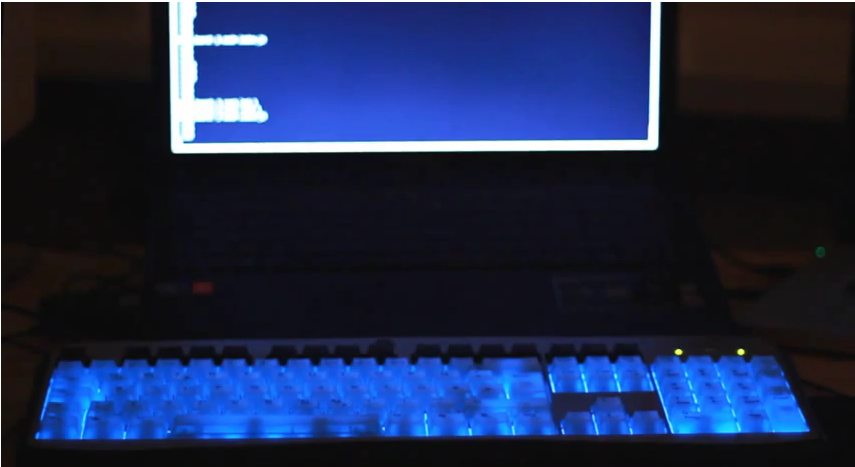

# More-Board
Make your keyboard back light (or any other light source you can control with a bash command) show Morse code.

[Quick YouTube demo](http://www.youtube.com/watch?v=ruJs7hYHqzA)

Dependencies: [async](https://npmjs.org/package/async), [morse](https://npmjs.org/package/morse)

